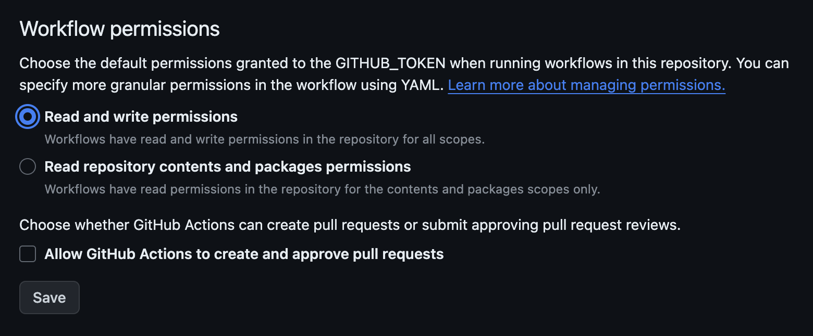

# Integrations

> **Note**: this document is a work in progress.

## GitHub Container Registry

[GitHub Container registry](https://github.com/features/packages) is used to store DevContainer images and Application 
images. By default, GitHub Actions don't have permission to write to the ghcr.io registry.

1. Go to: *Settings (of this repository)* -> *Actions* -> *General* -> *Workflow permissions*
2. Enable: *Read and write permissions*



## Codecov

1. Signup on [Codecov](https://about.codecov.io/sign-up/)
2. Setup repo 
3. Add `CODECOV_TOKEN` to [GitHub Secrets](https://docs.github.com/en/actions/reference/encrypted-secrets#creating-encrypted-secrets-for-a-repository) with the value from Codecov
4. Copy badge from Codecov to README.md
5. Add following to `.github/workflows/test.yml`:

```yaml
      - name: Upload coverage
        uses: codecov/codecov-action@v3
        with:
          files: reports/coverage.xml
        env:
          CODECOV_TOKEN: ${{ secrets.CODECOV_TOKEN }}
```
Link: https://github.com/codecov/codecov-action
